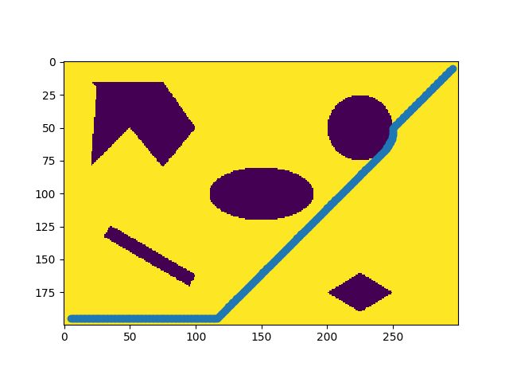

# Djikstra Implementation 

This is the implementation of dijkstra algorithm for point and rigid robots. This is our implementation of Project 2 as part of the course ENPM661.

## Dependencies
This code was tested with the following dependencies:
- Python 3
- Opencv 3.4.5
- Numpy

## Directories list

```
Project2
├── dijkstra_point.py
├── dijkstra_rigid.py
├── Map.py
├── pointMap.py
├── README.md
└── rigidMap.py
```


## Instructions

The directory `Project2` has two python files having the `main()` method namely `dijkstra_rigid.py` and `dijkstra_point.py` for rigid and point robot respectively.

### Rigid Robot
- Open new terminal window and run the command
```
python3 dijkstra_rigid.py
```  
- Enter the radius, clearance of robot and start node and goal node in cartesian coordinates.

### Point Robot
- Open new terminal window and run the command
```
python3 dijkstra_point.py
```  
- Enter the start node and goal node in cartesian coordinates.

## Results

The time taken by point robot for execution from start point `[5,5]` to goal point `[295,195]` is 5962 secs. The results are shown in the figure below where the blue line is the shortest path.



